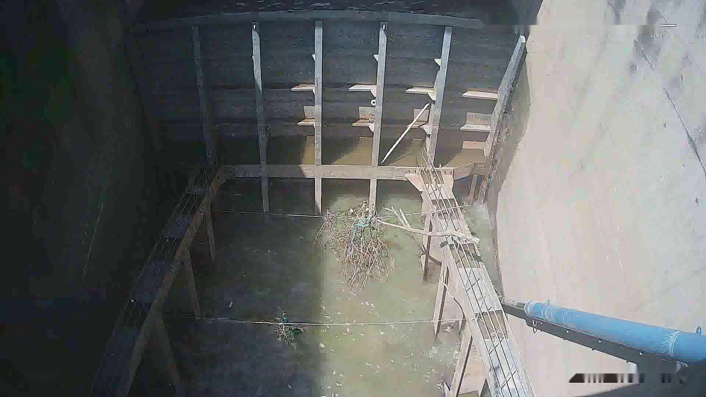
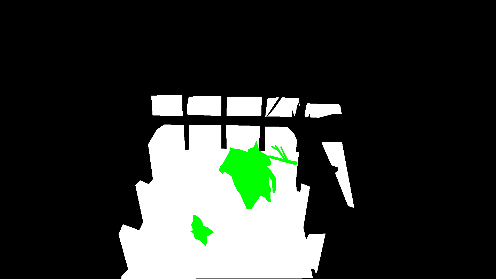
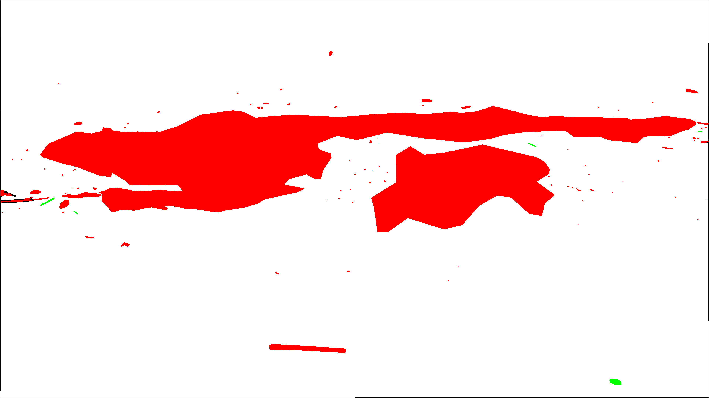
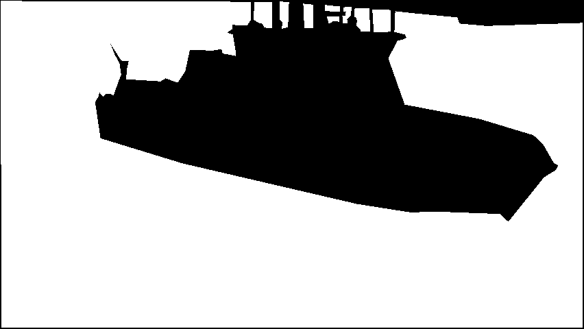
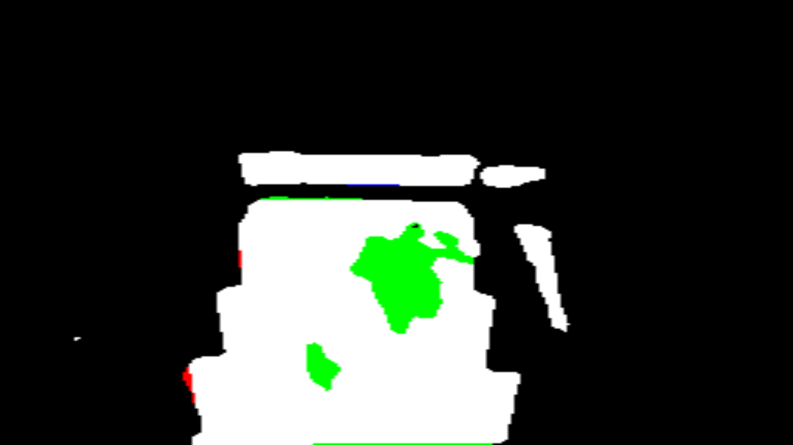
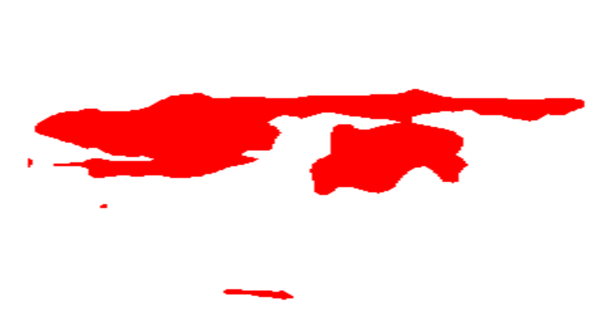
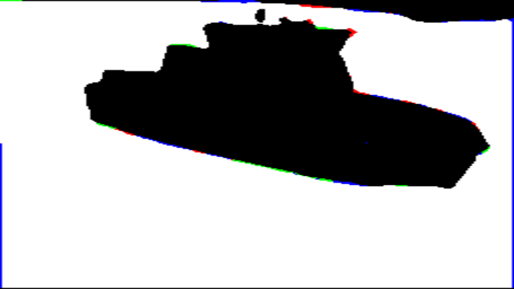

# Implementation of DeepLabV3+ with MobileNetV2

## Detailed Descriptions Seen in The Codes

This is an implementation of DeepLabV3+ with backbone MobileNetV2 using pytorch. Following are some instances of this model's performance.

The structure of this project seen in file "structure.txt"

image

    
    

label

    
    

mask

    
    

